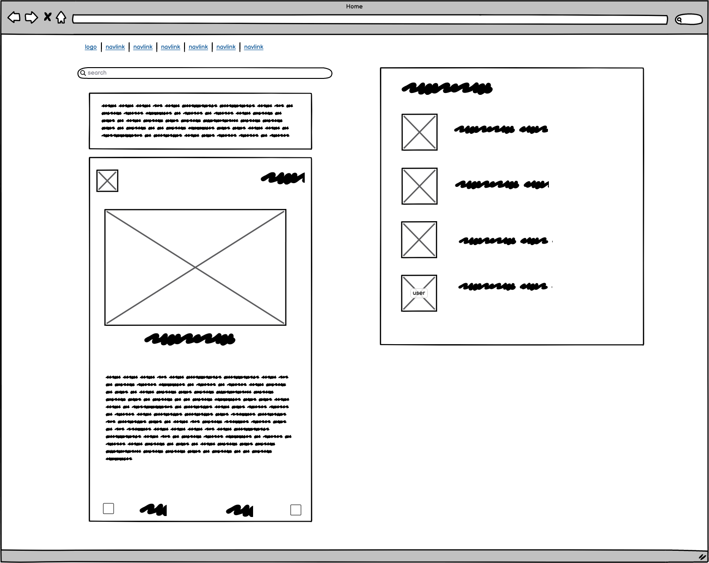
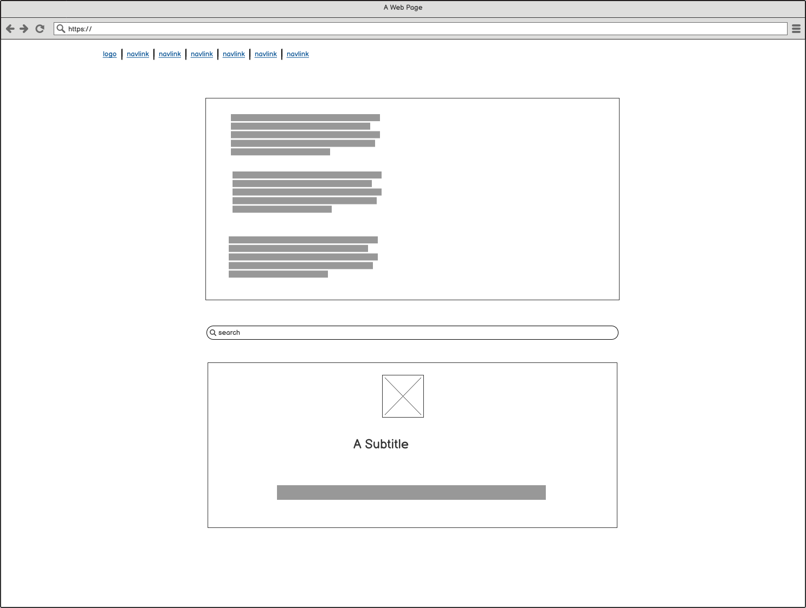
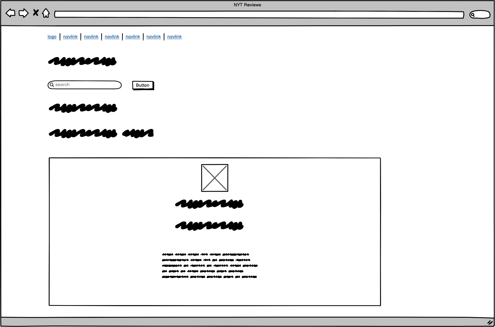
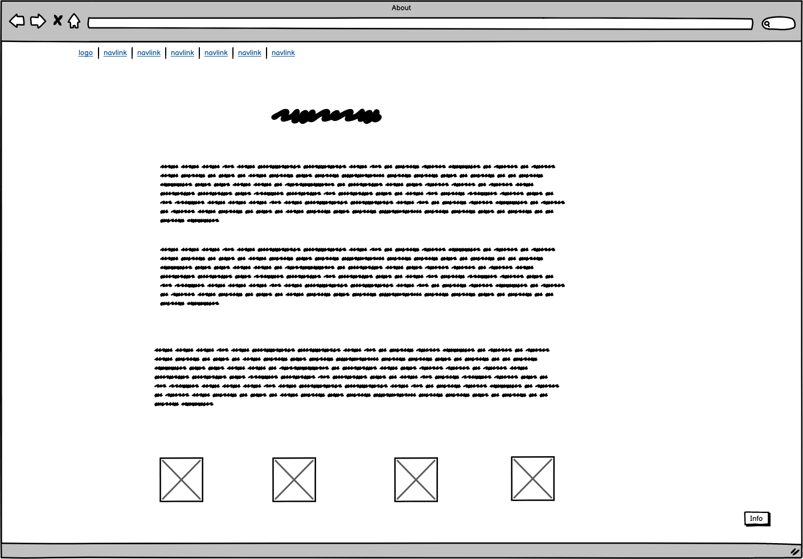
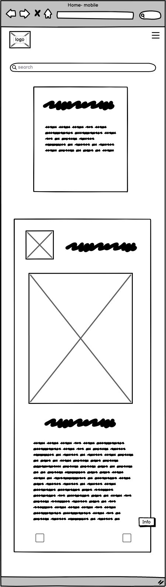

## Project Goals:

The inception of the **BookHub** application was motivated by a passion for literature and a desire to create a digital sanctuary for book enthusiasts. Here’s a concise overview of what I set out to achieve with this application:

1. **Build a Community of Book Lovers:**
   - To create a platform where users can come together to discuss, share, and explore books of varying genres, fostering a community of like-minded individuals who share a common love for literature (and hopefully no internet trolls...).

2. **Promote Knowledge Sharing:**
   - To enable users to share their thoughts, reviews, and insights about different books, thereby promoting the exchange of knowledge and perspectives within the community.

3. **Ease of Access:**
   - To provide a user-friendly interface that allows users to seamlessly navigate through the application, explore various books, read reviews, and interact with other community members.

4. **Integration with External Libraries:**
   - To integrate functionalities that allow users to search and explore books from external libraries like OpenLibrary, thus expanding the range of accessible literature.

5. **Inclusive and Diverse:**
   - To develop a platform that represents and celebrates diversity, inclusivity, and acceptance, catering to a global audience with varied tastes in literature.

6. **User Interaction and Engagement:**
   - To implement features that enable users to create profiles, add reviews, comment on existing reviews, and interact with other users, thereby enhancing user engagement and interaction within the platform.

7. **Responsive and Scalable:**
   - To design an application that is responsive, ensuring optimal user experience on various devices, and scalable, allowing for the incorporation of additional features and enhancements in the future.

Through the realization of these goals, **BookHub** aims to be a meeting place in the digital literary world, cultivating a space where the love for books brings people together.

## Component Architecture and Reuse

In this application, I have embraced React's philosophy of building small, reusable, and independent components. Below are the components developed along with their purposes and usages.

### 1. Asset.js  

**Purpose:** Provides the user with a spinner graphic when the page is loading info. This provides the user with a better UX experience- the user will know something is happening behind the scenes when code is too slow to load.

**Usage:** This component is used in multiple sections such as the main page review loads, user list loads, NYT reviews load, etc. 

2. Avatar.js

**Purpose:** The Avatar component is used to display a user's avatar image along with optional text. It is a reusable component utilized wherever a user’s avatar needs to be showcased within the application.

**Props:** 

* **src** (string): The source URL of the avatar image.
* **height** (number) : The height of the avatar image in pixels. Defaults to 45 if not provided.
* **text** (string): Optional text to be displayed alongside the avatar image.

**Usage**: This component is used on the main page in the review component, in the profile component, in the user list component, and so on. 

### 2. BookOfTheWeek.js

**Purpose:** 

The **BookOfTheWeek** component is designed to showcase the last book review that has been uploaded. It’s a dynamic component that fetches the book of the week from the backend and displays its title and author. If a book prop is provided, it will display the provided book instead of fetching it from the backend.

**Props:**

* **book** (object): An optional object representing a book. If provided, the component will display this book as the book of the week instead of fetching it from the backend. The object should have the following structure:
1. **title** (string): The title of the book.
2. **author_name** (string): The name of the author of the book.

**Usage:**

This component is used in a prominent location in the application: the homepage to highlight the most recently reviewed book to the users.

**State and Effects:**

**fetchedBook** (object): Holds the book object fetched from the backend. It is initially set to null.

**effects:** The component uses the useEffect hook to fetch the book of the week from the backend when the component mounts, if no book prop is provided. The fetched book is then set to the fetchedBook state variable.
For example:

```javascript
<BookOfTheWeek book={{ title: "Example Book", author_name: "Author Name" }} />
```
It's important to note that:
 
* If no book is provided via the book prop and no book is fetched from the backend, the component will render null.
* The component makes a GET request to 'https://bookhub-rdf-api-9aad7672239c.herokuapp.com/book-of-the-week/' to fetch the book of the week if no book prop is provided.

### 3. FloatingFooterButton.js

**Purpose:** The **FloatingFooterButton** component is utilized to create a button with a floating footer style. This button, when clicked, triggers an action defined by the parent component, making it a versatile and reusable button component throughout the application.

**Props:**
* **onClick** (function): A function that is triggered when the button is clicked. It is used to define what action should be performed on button click.

**Usage:** 

This component can be used wherever a button with floating footer style is required, and its action can be customized based on the parent component’s requirement.

**Example:**

```javascript
<FloatingFooterButton onClick={() => { console.log('Button Clicked!'); }} />
```

### 4. NavBar.js

**Purpose:**

The **NavBar** component is a crucial part of the application UI, rendering the navigation bar. It provides navigation links, user authentication options, user profile access, and additional features like adding a review. Depending on the user's authentication state, different options and icons are displayed.

**Usage:**

This component is used at the top of the application pages, ensuring consistent navigation across different sections of the application.

**State and Effects:**

* **State Variables:**
  * **expanded** (boolean): Represents whether the Navbar is expanded or not, managed by the custom hook `useClickOutsideToggle`.

* **Effects:**
  * The component leverages the `useEffect` hook in conjunction with the custom hook `useClickOutsideToggle`, to manage Navbar toggling based on user interaction.

**Context:**

* **useCurrentUser** and **useSetCurrentUser** from `CurrentUserContext` are used to access and manage the state of the current user.

**Custom Hooks:**

* **useClickOutsideToggle:** This custom hook is used to manage the toggling of the Navbar based on user clicks.

**Functions:**

* **handleSignOut:** This function handles user sign-out. It makes a POST request to logout the user and sets the current user to null.

**Example:**

```html
<NavBar />
``````

### 5. MoreDropdown.js

**Purpose:**

The **MoreDropdown** and **ProfileEditDropdown** components are designed to provide dropdown functionality with different options, enhancing the user interaction within the application. They both make use of a ref-forwarded component, **ThreeDots**, to trigger the dropdown.

#### MoreDropdown

**Props:**

* **handleEdit** (function): A function triggered when the edit option in the dropdown is clicked.
* **handleDelete** (function): A function triggered when the delete option in the dropdown is clicked.

**Usage:**

This component can be used wherever a dropdown menu with edit and delete options is required, allowing users to perform actions directly from the dropdown.

**Example:**

```html
<MoreDropdown handleEdit={editFunction} handleDelete={deleteFunction} />
```

### 6. FooterModal.js

**Purpose:**

The **FooterModal** component is responsible for rendering a modal that provides additional information about the application, such as “About Us”, “Contact” information, “Quick Links”, and social media links. It is designed to be a central place where users can get more details and understand more about the platform and its context.

**Props:**

* **show** (boolean): Determines whether the modal is visible or not.
* **handleClose** (function): A function triggered when the user decides to close the modal.

**Usage:**

This component can be utilized wherever there is a need to show more information to the user in a modal format, like in the footer section where users can access additional details about the platform.

**Example:**

```html
<FooterModal show={modalVisible} handleClose={closeModalFunction} />
```

### 7. AboutUs.js

**Purpose:**

The **AboutUs** component is designed to present detailed information about the BookHub platform. It outlines the mission, features, and beliefs of BookHub, providing users with a comprehensive overview of what the platform stands for and offers.

**Usage:**

This component is used in the “About Us” section of the application, serving as a dedicated space where users can learn more about BookHub and its objectives.

**Example:**

```html
<AboutUs />
```

### 8. LiteraryQuote.js

**Purpose:**

The **LiteraryQuote** component is intended to inspire users by displaying a random literary quote. This component fetches a random quote from an external API and displays it along with its author, providing daily literary inspiration to the users.

**State and Effects:**

* **State Variables:**
  * **quote** (Object): Holds the literary quote object fetched from the API. It is initially set to `null`.

* **Effects:**
  * The component uses the `useEffect` hook to fetch a random quote from 'https://api.quotable.io/random' when the component mounts.

**Usage:**

This component can be placed in any part of the application where you want to provide users with some literary inspiration, like on a dashboard or the homepage.

**Example:**

```html
<LiteraryQuote />
```
It's important to note:
* The LiteraryQuote component fetches a new quote every time it is mounted, ensuring that users get different quotes on different visits or refreshes.
* It provides a loading state to inform users that the quote is being fetched, ensuring a smooth user experience.
* The styling for this component is defined in the **LiteraryQuote.module.css** file, maintaining a consistent and appealing look.

### 9. NYTReviews.js

**Purpose:**

The **NYTReviews** component is developed to display a list of New York Times book reviews and the top 10 NYT Best Sellers. It allows users to search for reviews of specific books and provides links to the full reviews, integrating seamlessly with the New York Times API to fetch real-time data.

**State and Effects:**

* **State Variables:**
  * **reviews** (Array): Holds the list of reviews fetched from the NYT API. Initially an empty array.
  * **top10** (Array): Holds the list of top 10 NYT Best Sellers. Initially an empty array.
  * **loading** (boolean): Represents the loading state of the component. Initially `false`.
  * **error** (String): Holds the error message if there is an error while fetching data. Initially `null`.
  * **searchTerm** (String): Holds the search term entered by the user. Initially an empty string.

* **Effects:**
  * The component uses the `useEffect` hook to fetch the top 10 NYT Best Sellers when the component mounts.

**Usage:**

This component can be used to display book reviews and best sellers from the New York Times, offering users insights and recommendations for their next read.

**Example:**

```html
<NYTReviews />
```

It's important to note that:
* The NYTReviews component makes API calls to fetch reviews and best sellers' data, rendering dynamic content based on the fetched data.
* It manages various state variables to handle loading, errors, and user inputs efficiently, ensuring a smooth user experience.
* Users can search for reviews of specific books, and if there are no reviews found, the component informs the users accordingly.
* It provides links to the full reviews and displays images, titles, authors, plots, and other relevant information about the books, offering a comprehensive overview to the users.
* The styling for this component is defined in the **NYTReviews.module.css** file, maintaining a consistent and appealing look and feel.

### 10. OpenLibrarySearch.js

**Purpose:**

The **OpenLibrarySearch** component is developed to allow users to search and explore books from OpenLibrary.org, providing a seamless integration with Open Library's vast digital collection. It offers an infinite scrolling feature, allowing users to continuously load more search results as they scroll.

**State:**

* **State Variables:**
  * **searchTerm** (String): Holds the search term entered by the user. Initially an empty string.
  * **results** (Array): Holds the list of books fetched from Open Library. Initially an empty array.
  * **offset** (Number): Represents the page number for pagination with Open Library API. Initially `1`.
  * **hasMore** (Boolean): Determines whether more results can be fetched. Initially `true`.
  * **error** (String): Holds the error message if there is an error while fetching data. Initially `null`.
  * **searchInitiated** (Boolean): Represents whether a search has been initiated. Initially `false`.

**Usage:**

This component is used to offer users a search functionality to explore and discover books available on OpenLibrary.org, presenting results with book images, titles, authors, and publication years.

**Example:**

```html
<OpenLibrarySearch />
```
It's important to note that:
* The OpenLibrarySearch component makes API calls to https://openlibrary.org/search.json to fetch book data based on the user's search term, rendering dynamic content based on the fetched data.
* It manages various state variables to handle user inputs, loading, errors, and pagination efficiently, ensuring a smooth user experience.
* It provides links to OpenLibrary.org for each book in the search results, allowing users to explore more about the books.
* The component leverages the InfiniteScroll component to implement the infinite scrolling feature, loading more results as users scroll.
* If there is an error during the data fetching process, the component informs users accordingly.
* The styling for this component is defined in the **OpenLibrarySearch.module.css** file, maintaining a consistent and appealing look.

### 11. NotFoundPage.js

**Purpose:**

The **NotFoundPage** component serves as a user-friendly error page for users who navigate to a route that does not exist within the application. It provides a visual indicator, a clear message, and a convenient link to navigate back to the homepage.

**Usage:**

This component is rendered when a user navigates to a non-existent route within the application, providing an intuitive and user-friendly way to handle such errors.

**Example:**

```html
<NotFoundPage />
```

### There are several other components in this app...
The application is architected around the React framework, leveraging the power of reusable components to build a coherent, maintainable, and scalable codebase. Components such as **SignInForm**, **SignUpForm**, **Comment**, and **CommentCreateForm**, etc.,  are modular building blocks of the application that encapsulate specific functionalities. These components are reused across different parts of the application, ensuring consistency and reducing redundancy. Each component maintains its own state and lifecycle while possibly receiving data via props, allowing for data flow and clear separation of concerns. By structuring the application in this way, it’s easier to manage, develop, and debug, making the codebase more maintainable and scalable as the application evolves.

## UX Design Process for BookHub

**1. Objective Identification:**

From the outset, the goal of BookHub was clear: to create a centralized platform for book enthusiasts to discover, review, and discuss various books. The platform would not only serve as a repository of book reviews but also integrate external resources such as the New York Times bestsellers and OpenLibrary's vast collection.

**2. Wireframing:**

Initial wireframes were developed to outline the primary structure of the application. These wireframes provided a visual guide for the placement and interaction of elements on various pages such as the review page, book search, user profiles, and more. 

Below are some of the wireframes created for the project:

**The main page for large screens:**



**Open Library Search Page:**



**NYT Reviews and top ten page:**



**The About Page:**



**Small Screen View Of Main Page:**



**3. Component Design:**

The application was designed with component reusability in mind. Components like **Review**, **Asset**, and others were developed to be reused throughout the application to maintain consistency in design and functionality. This modular approach not only streamlined the development process but also ensured a consistent user experience across different parts of the application.

**4. Integration with External Resources:**

Special emphasis was given to integrating external resources seamlessly. For instance, the OpenLibrary search functionality was embedded within the platform, providing users the ability to search for books without leaving the BookHub environment.

**5. Responsive Design:**

Given the diverse range of devices users might access BookHub from, responsiveness was a key design consideration. Bootstrap's grid system was employed to ensure the application looked and functioned optimally across various device sizes in some parts, while flexbox was used in others. To further ensure ease of access for all screen sizes, REM units were used instead of pixels. 

**6. Feedback and Iteration:**

Following the initial design; feedback was sought to refine and optimize the user experience. This iterative process ensured that any usability issues were identified and rectified before the final deployment.

**7.  Follow-Through to Implementation:**

The design blueprints, as outlined in the wireframes and component designs, were closely followed during the development phase. Any deviations were carefully considered to ensure they enhanced, rather than detracted from, the user experience.