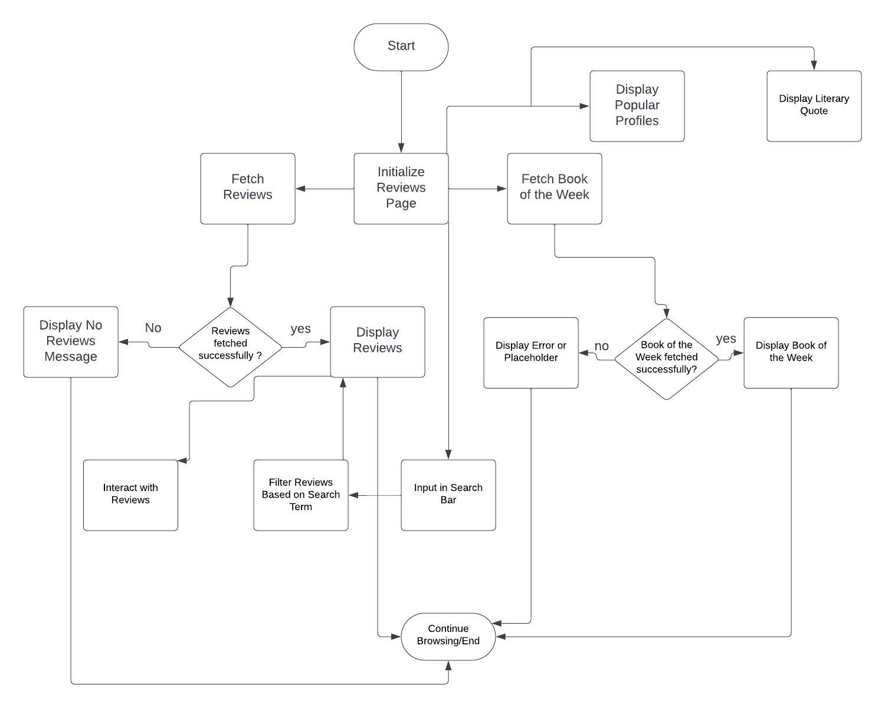

# BookHub: A Haven for Book Lovers
Welcome to **BookHub**, a dedicated platform for bibliophiles to connect, share, and indulge in their love for literature. Whether you're an avid reader looking for your next read, or simply someone seeking recommendations and reviews, BookHub is your one-stop destination.


## Why BookHub?

In the digital age, while there are myriad platforms to discuss movies, music, and other forms of entertainment, dedicated platforms for book enthusiasts are few and far between. BookHub aims to fill this void by offering:

- **Personalized Recommendations:** Tailored book suggestions based on your reading preferences.
- **Engaging Reviews:** Dive deep into comprehensive reviews and ratings from fellow readers.
- **Vibrant Community:** Engage in enriching discussions, join book clubs, or even start your own.

> "For words alone are certain good: Sing, then." - **W.B. Yeats**

## Connect to the App:

**BookHub** can be found [here.](https://bookhub-react-app-e2e5d4f08f69.herokuapp.com/)

**GitHub**:
- Front-End code link can be found [here.](https://github.com/leverh/react-bookhub-app/tree/secondary)

- Back-End code link is [here.](https://github.com/leverh/drf_api/tree/secondary)

## Project Goals:

The inception of the **BookHub** application was motivated by a passion for literature and a desire to create a digital sanctuary for book enthusiasts. Here’s a concise overview of what I set out to achieve with this application:

1. **Build a Community of Book Lovers:**
   - To create a platform where users can come together to discuss, share, and explore books of varying genres, fostering a community of like-minded individuals who share a common love for literature (and hopefully no internet trolls...).

2. **Promote Knowledge Sharing:**
   - To enable users to share their thoughts, reviews, and insights about different books, thereby promoting the exchange of knowledge and perspectives within the community.

3. **Ease of Access:**
   - To provide a user-friendly interface that allows users to seamlessly navigate through the application, explore various books, read reviews, and interact with other community members.

4. **Integration with External Libraries:**
   - To integrate functionalities that allow users to search and explore books from external libraries like OpenLibrary, thus expanding the range of accessible literature.

5. **Inclusive and Diverse:**
   - To develop a platform that represents and celebrates diversity, inclusivity, and acceptance, catering to a global audience with varied tastes in literature.

6. **User Interaction and Engagement:**
   - To implement features that enable users to create profiles, add reviews, comment on existing reviews, and interact with other users, thereby enhancing user engagement and interaction within the platform.

7. **Responsive and Scalable:**
   - To design an application that is responsive, ensuring optimal user experience on various devices, and scalable, allowing for the incorporation of additional features and enhancements in the future.

Through the realization of these goals, **BookHub** aims to be a meeting place in the digital literary world, cultivating a space where the love for books brings people together.

## Component Architecture and Reuse

In this application, I have embraced React's philosophy of building small, reusable, and independent components. Below are the components developed along with their purposes and usages.

### 1. Asset.js  

**Purpose:** Provides the user with a spinner graphic when the page is loading info. This provides the user with a better UX experience- the user will know something is happening behind the scenes when code is too slow to load.

**Usage:** This component is used in multiple sections such as the main page review loads, user list loads, NYT reviews load, etc. 

2. Avatar.js

**Purpose:** The Avatar component is used to display a user's avatar image along with optional text. It is a reusable component utilized wherever a user’s avatar needs to be showcased within the application.

**Props:** 

* **src** (string): The source URL of the avatar image.
* **height** (number) : The height of the avatar image in pixels. Defaults to 45 if not provided.
* **text** (string): Optional text to be displayed alongside the avatar image.

**Usage**: This component is used on the main page in the review component, in the profile component, in the user list component, and so on. 

### 2. BookOfTheWeek.js

**Purpose:** 

The **BookOfTheWeek** component is designed to showcase recommended book review that have been uploaded. It’s a dynamic component that fetches the book of the week from the backend and displays its title and author. If a book prop is provided, it will display the provided book instead of fetching it from the backend.

**Props:**

* **book** (object): An optional object representing a book. If provided, the component will display this book as the book of the week instead of fetching it from the backend. The object should have the following structure:
1. **title** (string): The title of the book.
2. **author_name** (string): The name of the author of the book.

**Usage:**

This component is used in a prominent location in the application's with the purpose of acquainting the users with reviews posted a while back (if the reviews database grows substantially...).

**State and Effects:**

**fetchedBook** (object): Holds the book object fetched from the backend. It is initially set to null.

**effects:** The component uses the useEffect hook to fetch the book of the week from the backend when the component mounts, if no book prop is provided. The fetched book is then set to the fetchedBook state variable.
For example:

```javascript
<BookOfTheWeek book={{ title: "Example Book", author_name: "Author Name" }} />
```
It's important to note that:
 
* If no book is provided via the book prop and no book is fetched from the backend, the component will render null.
* The component makes a GET request to 'https://bookhub-rdf-api-9aad7672239c.herokuapp.com/book-of-the-week/' to fetch the book of the week if no book prop is provided.

### 3. FloatingFooterButton.js

**Purpose:** The **FloatingFooterButton** component is utilized to create a button with a floating footer style. This button, when clicked, triggers an action defined by the parent component, making it a versatile and reusable button component throughout the application.

**Props:**
* **onClick** (function): A function that is triggered when the button is clicked. It is used to define what action should be performed on button click.

**Usage:** 

This component can be used wherever a button with floating footer style is required, and its action can be customized based on the parent component’s requirement.

**Example:**

```html
<FloatingFooterButton onClick={() => { console.log('Button Clicked!'); }} />
```

### 4. NavBar.js

**Purpose:**

The **NavBar** component is a crucial part of the application UI, rendering the navigation bar. It provides navigation links, user authentication options, user profile access, and additional features like adding a review. Depending on the user's authentication state, different options and icons are displayed.

**Usage:**

This component is used at the top of the application pages, ensuring consistent navigation across different sections of the application.

**State and Effects:**

* **State Variables:**
  * **expanded** (boolean): Represents whether the Navbar is expanded or not, managed by the custom hook `useClickOutsideToggle`.

* **Effects:**
  * The component leverages the `useEffect` hook in conjunction with the custom hook `useClickOutsideToggle`, to manage Navbar toggling based on user interaction.

**Context:**

* **useCurrentUser** and **useSetCurrentUser** from `CurrentUserContext` are used to access and manage the state of the current user.

**Custom Hooks:**

* **useClickOutsideToggle:** This custom hook is used to manage the toggling of the Navbar based on user clicks.

**Functions:**

* **handleSignOut:** This function handles user sign-out. It makes a POST request to logout the user and sets the current user to null.

**Example:**

```html
<NavBar />
``````

### 5. MoreDropdown.js

**Purpose:**

The **MoreDropdown** and **ProfileEditDropdown** components are designed to provide dropdown functionality with different options, enhancing the user interaction within the application. They both make use of a ref-forwarded component, **ThreeDots**, to trigger the dropdown.

#### MoreDropdown

**Props:**

* **handleEdit** (function): A function triggered when the edit option in the dropdown is clicked.
* **handleDelete** (function): A function triggered when the delete option in the dropdown is clicked.

**Usage:**

This component can be used wherever a dropdown menu with edit and delete options is required, allowing users to perform actions directly from the dropdown.

**Example:**

```html
<MoreDropdown handleEdit={editFunction} handleDelete={deleteFunction} />
```

### 6. FooterModal.js

**Purpose:**

The **FooterModal** component is responsible for rendering a modal that provides additional information about the application, such as “About Us”, “Contact” information, “Quick Links”, and social media links. It is designed to be a central place where users can get more details and understand more about the platform and its context.

**Props:**

* **show** (boolean): Determines whether the modal is visible or not.
* **handleClose** (function): A function triggered when the user decides to close the modal.

**Usage:**

This component can be utilized wherever there is a need to show more information to the user in a modal format, like in the footer section where users can access additional details about the platform.

**Example:**

```html
<FooterModal show={modalVisible} handleClose={closeModalFunction} />
```

### 7. AboutUs.js

**Purpose:**

The **AboutUs** component is designed to present detailed information about the BookHub platform. It outlines the mission, features, and beliefs of BookHub, providing users with a comprehensive overview of what the platform stands for and offers.

**Usage:**

This component is used in the “About Us” section of the application, serving as a dedicated space where users can learn more about BookHub and its objectives.

**Example:**

```html
<AboutUs />
```

### 8. LiteraryQuote.js

**Purpose:**

The **LiteraryQuote** component is intended to inspire users by displaying a random literary quote. This component fetches a random quote from an external API and displays it along with its author, providing daily literary inspiration to the users.

**State and Effects:**

* **State Variables:**
  * **quote** (Object): Holds the literary quote object fetched from the API. It is initially set to `null`.

* **Effects:**
  * The component uses the `useEffect` hook to fetch a random quote from 'https://api.quotable.io/random' when the component mounts.

**Usage:**

This component can be placed in any part of the application where you want to provide users with some literary inspiration, like on a dashboard or the homepage.

**Example:**

```html
<LiteraryQuote />
```
It's important to note:
* The LiteraryQuote component fetches a new quote every time it is mounted, ensuring that users get different quotes on different visits or refreshes.
* It provides a loading state to inform users that the quote is being fetched, ensuring a smooth user experience.
* The styling for this component is defined in the **LiteraryQuote.module.css** file, maintaining a consistent and appealing look.

### 9. NYTReviews.js

**Purpose:**

The **NYTReviews** component is developed to display a list of New York Times book reviews and the top 10 NYT Best Sellers. It allows users to search for reviews of specific books and provides links to the full reviews, integrating seamlessly with the New York Times API to fetch real-time data.

**State and Effects:**

* **State Variables:**
  * **reviews** (Array): Holds the list of reviews fetched from the NYT API. Initially an empty array.
  * **top10** (Array): Holds the list of top 10 NYT Best Sellers. Initially an empty array.
  * **loading** (boolean): Represents the loading state of the component. Initially `false`.
  * **error** (String): Holds the error message if there is an error while fetching data. Initially `null`.
  * **searchTerm** (String): Holds the search term entered by the user. Initially an empty string.

* **Effects:**
  * The component uses the `useEffect` hook to fetch the top 10 NYT Best Sellers when the component mounts.

**Usage:**

This component can be used to display book reviews and best sellers from the New York Times, offering users insights and recommendations for their next read.

**Example:**

```html
<NYTReviews />
```

It's important to note that:
* The NYTReviews component makes API calls to fetch reviews and best sellers' data, rendering dynamic content based on the fetched data.
* It manages various state variables to handle loading, errors, and user inputs efficiently, ensuring a smooth user experience.
* Users can search for reviews of specific books, and if there are no reviews found, the component informs the users accordingly.
* It provides links to the full reviews and displays images, titles, authors, plots, and other relevant information about the books, offering a comprehensive overview to the users.
* The styling for this component is defined in the **NYTReviews.module.css** file, maintaining a consistent and appealing look and feel.

### 10. OpenLibrarySearch.js

**Purpose:**

The **OpenLibrarySearch** component is developed to allow users to search and explore books from OpenLibrary.org, providing a seamless integration with Open Library's vast digital collection. It offers an infinite scrolling feature, allowing users to continuously load more search results as they scroll.

**State:**

* **State Variables:**
  * **searchTerm** (String): Holds the search term entered by the user. Initially an empty string.
  * **results** (Array): Holds the list of books fetched from Open Library. Initially an empty array.
  * **offset** (Number): Represents the page number for pagination with Open Library API. Initially `1`.
  * **hasMore** (Boolean): Determines whether more results can be fetched. Initially `true`.
  * **error** (String): Holds the error message if there is an error while fetching data. Initially `null`.
  * **searchInitiated** (Boolean): Represents whether a search has been initiated. Initially `false`.

**Usage:**

This component is used to offer users a search functionality to explore and discover books available on OpenLibrary.org, presenting results with book images, titles, authors, and publication years.

**Example:**

```html
<OpenLibrarySearch />
```
It's important to note that:
* The OpenLibrarySearch component makes API calls to https://openlibrary.org/search.json to fetch book data based on the user's search term, rendering dynamic content based on the fetched data.
* It manages various state variables to handle user inputs, loading, errors, and pagination efficiently, ensuring a smooth user experience.
* It provides links to OpenLibrary.org for each book in the search results, allowing users to explore more about the books.
* The component leverages the InfiniteScroll component to implement the infinite scrolling feature, loading more results as users scroll.
* If there is an error during the data fetching process, the component informs users accordingly.
* The styling for this component is defined in the **OpenLibrarySearch.module.css** file, maintaining a consistent and appealing look.


### 11. ScrollToTopButton.js

**Purpose:**
The **ScrollToTopButton** component provides an easily accessible button for users to navigate back to the top of the page. It's particularly useful on longer pages where scrolling manually would be tedious. The button is designed to be visually appealing and intuitive, and it only appears once the user has scrolled down, ensuring that it doesn't clutter the interface when not needed.

**Usage:**
The **ScrollToTopButton** is used globally across the application. It is particularly helpful on pages with lengthy content like the reviews page, NYT reviews and top 10 page, The OpenLibrary page, etc.

**Example:**
```html
<ScrollToTopButton />
```

It's important to note that:

Initially, I used the React library component for the "scroll to top" functionality. However, after encountering some compatibility and styling limitations, I decided to build a custom "scroll to top" button. This not only allowed for greater flexibility in terms of design and positioning but also ensured that the component would seamlessly integrate with the rest of the application's architecture and styling. The custom solution also provided an opportunity to tailor the user experience more closely to the app's unique requirements and aesthetics.

### 12. NotFoundPage.js

**Purpose:**

The **NotFoundPage** component serves as a user-friendly error page for users who navigate to a route that does not exist within the application. It provides a visual indicator, a clear message, and a convenient link to navigate back to the homepage.

**Usage:**

This component is rendered when a user navigates to a non-existent route within the application, providing an intuitive and user-friendly way to handle such errors.

**Example:**

```html
<NotFoundPage />
```


### There are several other components in this app...
The application is architected around the React framework, leveraging the power of reusable components to build a coherent, maintainable, and scalable codebase. Components such as **SignInForm**, **SignUpForm**, **Comment**, and **CommentCreateForm**, **ScrollToTopButton**, etc.,  are modular building blocks of the application that encapsulate specific functionalities. These components are reused across different parts of the application, ensuring consistency and reducing redundancy. Each component maintains its own state and lifecycle while possibly receiving data via props, allowing for data flow and clear separation of concerns. By structuring the application in this way, it’s easier to manage, develop, and debug, making the codebase more maintainable and scalable as the application evolves.

## UX Design Process for BookHub

**1. Objective Identification:**

From the outset, the goal of BookHub was clear: to create a centralized platform for book enthusiasts to discover, review, and discuss various books. The platform would not only serve as a repository of book reviews but also integrate external resources such as the New York Times bestsellers and OpenLibrary's vast collection.

**2. Wireframing:**

Initial wireframes were developed to outline the primary structure of the application. These wireframes provided a visual guide for the placement and interaction of elements on various pages such as the review page, book search, user profiles, and more. 

Below are some of the wireframes created for the project:

**The main page for large screens:**


**Open Library Search Page:**


**NYT Reviews and top ten page:**


**The About Page:**


**Small Screen View Of Main Page:**


**3. Component Design:**

The application was designed with component reusability in mind. Components like **Review**, **Asset**, and others were developed to be reused throughout the application to maintain consistency in design and functionality. This modular approach not only streamlined the development process but also ensured a consistent user experience across different parts of the application.

**4. Integration with External Resources:**

Special emphasis was given to integrating external resources seamlessly. For instance, the OpenLibrary search functionality was embedded within the platform, providing users the ability to search for books without leaving the BookHub environment.

**5. Responsive Design:**

Given the diverse range of devices users might access BookHub from, responsiveness was a key design consideration. Bootstrap's grid system was employed to ensure the application looked and functioned optimally across various device sizes in some parts, while flexbox was used in others. To further ensure ease of access for all screen sizes, REM units were used instead of pixels. 

**6. Feedback and Iteration:**

Following the initial design; feedback was sought to refine and optimize the user experience. This iterative process ensured that any usability issues were identified and rectified before the final deployment.

**7.  Follow-Through to Implementation:**

The design blueprints, as outlined in the wireframes and component designs, were closely followed during the development phase. Any deviations were carefully considered to ensure they enhanced, rather than detracted from, the user experience.

### Color Choices in BookHub

Colors play a pivotal role in determining the overall mood of an application and significantly influence user experience. For BookHub, the colors have been carefully selected to create a harmonious, engaging, and intuitive environment for users.

#### **1. Background: #F2E6D3**
This soft, neutral hue provides a warm and inviting backdrop for the application. The color's lightness helps ensure that all text remains readable, and it offers a calm and non-distracting environment for users to engage with content.

#### **2. Text: #333333**
A nearly black shade, `#333333`, is used for the primary text. This color offers excellent contrast against the light background, ensuring readability. The choice of a slightly off-black hue softens the appearance and feels less harsh than a stark black.

#### **3. Buttons: #B07D28**
The golden-brown tone for buttons gives them a distinct appearance, making them easily identifiable as interactive elements. This color choice adds a touch of elegance and warmth, inviting users to interact.

#### **4. Hover Effects: Underline ##FFA500 and Color #444444**
The choice of a vibrant orange #FFA500 for link underlines ensures that links stand out in the content, signaling to users that they are interactive. This bright shade not only grabs attention but also adds an element of excitement to the design.


Incorporating a well-thought-out color scheme aids in creating a cohesive visual experience. The chosen palette for BookHub aligns with the platform's goal of offering a serene environment for book enthusiasts while ensuring ease of use and intuitive navigation.


### Contrasts:

Color contrasts and accessibility are paramount in website design, serving a dual purpose of aesthetics and functionality. Proper contrast ensures that text and interactive elements are easily distinguishable, enhancing readability and reducing strain on the eyes. More importantly, it caters to a diverse audience, including those with visual impairments or color blindness, ensuring that everyone has an equal opportunity to access and enjoy the content. 

For me, as a developer or designer, prioritizing accessibility broadens the reach of my website (or app), potentially increasing engagement. By adhering to accessibility standards, I think that we demonstrate a commitment to delivering a user-friendly and universally welcoming digital experience.


### User Experience Flowchart

In the development of the BookHub application, I prioritized clarity and user-centric design. To ensure that every interaction was intuitive and meaningful, I laid out a User Experience (UX) flowchart. This visual representation helped me map out the user's journey through the **ReviewsPage** of the application.

#### Purpose of the Flowchart:

1. **Visualization:** Before diving into the code, the flowchart provided a clear picture of how the different components and functionalities of the **ReviewsPage** interact with each other.

2. **User-Centered Design:** It assisted in ensuring that user interactions were smooth, logical, and minimized unnecessary steps.

3. **Workflow:** The flowchart served as a reference point for the development, ensuring I was aligned with the intended user experience.

4. **Refinement:** As the development progressed, referring back to the flowchart helped in identifying areas of improvement or simplification.

#### Flowchart Key Features

* **Data Fetching:**  The flowchart showcases how the application fetches reviews and the 'Book of the Week' upon loading the **ReviewsPage**.

* **User Interaction:** It highlights the user's ability to search for specific reviews and how the system responds to these queries.

* **Visual Feedback:** The flowchart represents different states of the application, such as loading states and the display of results or lack thereof.



## User Stories

### Introduction

User stories provide a simple, informal explanation of a software feature from the perspective of an end user. They help to ensure that the development remains user-centric. Each user story in this project is aligned with the the project goals.

#### Project Goals

1. **Build a Community**: Create a platform where book enthusiasts can connect, share their thoughts, and get recommendations.

2. **Enhance User Engagement:** Provide features that keep users engaged, like reviews, book of the week, and literary quotes.

3. **Ensure Intuitive User Experience:** Offer a simple, clean, and intuitive user interface that users can navigate effortlessly.

#### User Stories

1. **Review Sharing and Exploration**

* As a user, I want to view the latest book reviews so that I can discover new books and get insights about them.
* As a user, I want to search for specific reviews to find thoughts on books I'm interested in.

2. **Community Building**
* As a user, I want to view popular profiles so that I can follow active members and enhance my community experience.
* As a user, I want to follow/unfollow other members to personalize my feed and interactions.
* As a user, I want to be able to comment and engage with other users regarding book reviews.

3. **Engagement Features**
* As a user, I want to view the 'Book of the Week' to discover popular and recommended reads.
* As a user, I want to see a literary quote for daily inspiration and reflection.

4. **Profile Management and Interaction**
* As a user, I want the application to be visually appealing and functional regardless of the device I'm using, ensuring consistent user experience.
* As a user, I want fast load times and smooth transitions, especially when I'm accessing the platform on mobile devices.
* As a user, I want to see the number of reviews I've written, the followers I have, and the profiles I follow.

5. **Error Handling and User Feedback**
* As a user, I want to be informed when something goes wrong or when there's no data to display, ensuring I'm not left in the dark about what's happening.

6. **Inclusivity and Diversity**
* As a user, I want to explore literature from various cultures and perspectives to broaden my understanding and appreciation of global narratives.
* As a user, I want to be part of a platform that promotes inclusivity, where I can express my views without prejudice.

7. **Ease of Access and Navigation**
* As a user, I want an intuitive layout that makes it easy for me to find what I'm looking for, ensuring a smooth user experience.
* As a user, I want to easily navigate between different sections of the app, like reviews, profiles, and external libraries.

8. **Integration with External Libraries**
* As a user, I want to search for books not just within the community but also from external sources like OpenLibrary or the New York Times to have a comprehensive list of options.
* As a user, I want direct links to sources where I can access, read, or purchase the book, making the journey from discovery to reading seamless.

9. **Accessibility Features**
* As a user, I want the platform to be accessible, catering to users with disabilities with features like a screen reader or high contrast mode.
* As a user, I want to adjust the text size or choose between different themes to customize my reading experience.

#### Mapping User Stories to Project Goals
* **Build a Community of Book Lovers:** The ability to view reviews, follow users, and explore popular profiles directly contributes to community building.
* **Promote Knowledge Sharing:** User reviews, comments, and the integration with external libraries like OpenLibrary facilitate knowledge sharing.
* **Enhance User Engagement:** Features like 'Book of the Week', literary quotes, and the search functionality keep users engaged and encourage regular visits.
* **Ensure Intuitive User Experience:** The clear layout of reviews, profiles, and the seamless interaction between different components ensures a user-friendly experience.
* **Ease of Access:** The addition of accessibility features ensures a wider range of users can navigate and utilize the platform with ease.
* **Integration with External Libraries:** The search functionality, which extends to sources like OpenLibrary, NYT Reviews, ensure this goal is met.
* **Inclusive and Diverse:**  By allowing literature exploration from various cultures and promoting a prejudice-free platform, this goal is addressed.
* **User Interaction and Engagement:** Features like user profiles, the ability to add reviews, comment, and interact ensure high user engagement.
* **Responsive and Scalable:** The design of the application, which ensures optimal performance across devices, and its architecture that allows for future enhancements, align with this goal.

## Front-End Libraries and Their Justifications

1. **React:**
* **Usage:** React is the primary library used to build the user interface of the application.
* **Justification:** React's component-based architecture promotes reusability and scalability. Its virtual DOM ensures efficient updates and rendering, making it a solid choice for dynamic applications like BookHub.

2. **react-bootstrap:**
* **Usage:** This library provides responsive design components like **Col**, **Row**, **Container**, **Button**, and **Image**.
* **Justification:** React-bootstrap allows for rapid development with a consistent design. It's based on Bootstrap, a widely recognized and adaptable front-end framework, ensuring a responsive and modern UI.Though personally, I prefer using 'vanilla' CSS as I find its flexibility exciting and creative.

3. **react-router:**
* **Usage:** Used for client-side routing in the application, as seen with **useLocation** and **useParams**.
* **Justification:** React Router provides seamless navigation between components without refreshing the page, enhancing user experience and performance.

4. **react-infinite-scroll-component:**
* **Usage:** Implemented for loading more data as the user scrolls.
* **Justification:** Infinite scrolling improves user experience by eliminating the need for pagination and loading content seamlessly, providing a more fluid browsing experience.

5. **axios:**
* **Usage:** For making HTTP requests, as observed in the **axiosReq** utility.
* **Justification:** Axios is a popular promise-based HTTP client for JavaScript, allowing for easier error handling, request and response interception, and overall cleaner asynchronous code compared to the traditional XMLHttpRequest.

6. **OpenLibrary API:**
* **Usage:** Integrated to search and explore books from an external library.
* **Justification:** OpenLibrary provides a vast database of books. By integrating this API, BookHub can offer users an expansive range of literature to explore beyond community reviews.

7. **New York Times API:**
* **Usage:** Integrated to search and explore books from a renowned external library.
* **Justification:** The NYT API provides a vast database of books and book reviews, as well as the current 10 best selling books list. 

8. **Self-made-scroll-up-button:** 
* **Usage:** Provides a customizable "Scroll to Top" button for the application.
* **Justification:** Enhancing user experience is crucial, especially in applications with lengthy content. A "Scroll to Top" button provides users with a quick and convenient way to navigate back to the top of the page, eliminating the need for manual scrolling. The custom-made-scroll-up-button offers an out-of-the-box solution for this with customization options to ensure the button fits seamlessly into the application's design.

## Front-End Testing

### Manual Testing Procedures and Results

To ensure the reliability of the **BookHub** application, extensive manual testing was conducted. The following outlines the procedures undertaken and the results:

### 1. **User Registration and Login:**
- **Procedure:**
  - Navigate to the registration page.
  - Fill out the registration form with various data sets, including:
    - Valid data.
    - Missing mandatory fields.
    - Incorrectly formatted email addresses.
  - Attempt to log in with the newly created user credentials.
  - Attempt to log in with incorrect credentials.
- **Results:**
  - Registration was successful with valid data.
  - Appropriate error messages were displayed for missing or incorrect data.
  - Login was successful with correct credentials and failed with incorrect ones.

### 2. **Review Posting and Editing:**
- **Procedure:**
  - Navigate to the review creation page.
  - Try posting a review without filling in any details.
  - Post a review with all details filled.
  - Edit the posted review.
- **Results:**
  - The application prevented posting an empty review and displayed an appropriate error message.
  - Reviews were successfully posted and displayed on the platform.
  - Edits to reviews were reflected immediately.

### 3. **Search Functionality:**
- **Procedure:**
  - Use the search bar to look for specific book titles or authors.
  - Try searches with misspellings.
- **Results:**
  - Searches returned relevant results.
  - The search was forgiving of minor misspellings.

### 4. **Responsive Design:**
- **Procedure:**
  - Open the application on various devices, including desktop, tablet, and mobile.
  - Resize the browser window to various sizes.
- **Results:**
  - The application's design was fluid and adapted to various screen sizes.
  - No major design breaks or unresponsive elements were observed.

### 5. **External Libraries Integration:**
- **Procedure:**
  - Search for a book using the integrated OpenLibrary search.
  - Check the results for relevancy.
- **Results:**
  - The search returned relevant results from OpenLibrary.
  - Book details from external libraries were displayed correctly.

### 6. **User Profile and Interactions:**
- **Procedure:**
  - Visit a user's profile.
  - Try following and unfollowing the user.
  - Navigate to your profile and check the follower count.
- **Results:**
  - The follow/unfollow functionality worked as expected.
  - Follower counts updated in real-time.

### 7. **Scroll to Top Button:**
- **Procedure:**
  - Scroll down on a long page.
  - Click the "Scroll to Top" button.
- **Results:**
  - The page smoothly scrolled back to the top upon button click.

### 8. **Commenting on Reviews:**
- **Procedure:**
  - Navigate to a book review.
  - Attempt to post an empty comment.
  - Post a valid comment.
  - Edit your comment.
  - Delete your comment.
- **Results:**
  - The application prevented posting an empty comment with an appropriate error message.
  - Comments were successfully posted below the review.
  - Edits to comments were reflected immediately.
  - Deleted comments were removed from the review's comment section.

### 9. **Navigation and Page Loading:**
- **Procedure:**
  - Use the main navigation bar to switch between different sections of the application.
  - Observe the page loading times and any potential errors.
- **Results:**
  - Navigation between different sections was smooth.
  - Pages loaded quickly without any noticeable lag or errors.

### 10. **Profile Picture Upload:**
- **Procedure:**
  - Navigate to your user profile.
  - Attempt to upload different file types as profile pictures, including non-image files.
  - Upload a valid image file.
- **Results:**
  - Non-image files were rejected with an appropriate error message.
  - Valid image files were successfully uploaded and displayed as the profile picture.

### 11. **Following and Followers List:**
- **Procedure:**
  - Follow several users.
  - Navigate to your profile and click on "Following" to see the list of users you're following.
  - Unfollow a user and check the list again.
  - Click on "Followers" to see the list of users following you.
- **Results:**
  - The "Following" list correctly displayed the users being followed.
  - Upon unfollowing, users were removed from the "Following" list.
  - The "Followers" list correctly displayed users following you.

### 12. **Notification System:**
- **Procedure:**
  - Perform actions that trigger notifications, such as receiving a comment on your review or being followed by another user.
  - Navigate to the notifications section.
- **Results:**
  - Notifications were received in real-time.
  - The notifications section displayed all recent notifications with appropriate messages.

### 13. **Book Recommendations:**
- **Procedure:**
  - Navigate to the recommendations section.
  - Observe the books recommended based on your previous reviews and ratings.
- **Results:**
  - The recommendations seemed relevant and based on user preferences.

### 14. **Error Handling and Messages:**
- **Procedure:**
  - Intentionally trigger errors, such as trying to access a non-existent page or trying to post invalid data.
  - Observe the error messages and how the application handles them.
- **Results:**
  - User-friendly error messages were displayed.
  - The application did not crash and gracefully handled errors, redirecting users or providing solutions when possible.

### 15. **Logout and Session Handling:**
- **Procedure:**
  - Log out of the application.
  - Try to access user-specific sections without logging in.
- **Results:**
  - Successfully logged out and sessions were terminated.
  - Without being logged in, user-specific sections were inaccessible, ensuring user data privacy.

### 16. **Navigation Bar Interactivity:**
- **Procedure:**
  - Hover over different elements in the navigation bar.
  - Check for any dropdowns or tooltips that should appear.
  - Verify if the active section is highlighted differently.
- **Results:**
  - Hovering effects (like dropdowns or tooltips) appeared as expected.
  -  Active section was distinguishable from other navigation links.

### 17. **Pagination and Infinite Scrolling:**
- **Procedure:**
  - Navigate to a section of the application that has multiple pages or uses infinite scrolling.
  - Scroll through the items and observe the loading of additional content.
  - If pagination is used, click through different page numbers.
- **Results:**
  -  New content loaded seamlessly as the user scrolled down.
  -  Pagination worked correctly, displaying a different set of items for each page.
### 18. **Form Validations**:
- **Procedure**:
  - Go to any form within the application.
  - Enter data that doesn't meet the validation criteria (e.g., a password that's too short).
  - Submit the form.
- **Results**:
  - The form displayed clear validation error messages.
  - The form prevented submission until valid data was entered.

### 19. **Favorites and Bookmarks**:
- **Procedure**:
  - Try adding an item (like a book or a review) to your favorites or bookmarks.
  - Navigate to your profile or a dedicated section where you can view your favorites/bookmarks.
  - Remove an item from your favorites/bookmarks.
- **Results**:
  - The item was successfully added and reflected in the user's favorites/bookmarks list.
  - Removing the item from favorites/bookmarks also worked seamlessly.

### 20. **Dynamic Data Loading**:
- **Procedure**:
  - Navigate to a section where data is fetched dynamically (e.g., a live search or a dynamic chart).
  - Interact with the section and observe the data changes.
- **Results**:
  - Data was fetched and displayed in real-time based on user interactions.

### 21. **User Feedback on Actions**:
- **Procedure**:
  - Perform various actions like posting a comment, liking a review, or adding a book.
  - Observe if there's any feedback provided to the user (like a success message or a loading spinner- or a re-direct).
- **Results**:
  - User received immediate feedback on their actions, ensuring clarity and a good user experience.

### 22. **Accessibility Features**:
- **Procedure**:
  - Navigate the website using only a keyboard.
  - Use screen reading tools, if available, to check how the website is read out.
- **Results**:
  - The website was navigable using just the keyboard.
  - Screen reading tools provided an accurate and user-friendly reading of the website.

### 23. **Pop-up Modals and Dialogs**:
- **Procedure**:
  - Trigger any pop-up modals or dialog boxes in the application (e.g., by clicking on a "More Info" button).
  - Interact with the modal (close it, fill it out, etc.).
- **Results**:
  - Modals and dialogs appeared as expected and were interactive.
  - Closing or submitting the modal/dialog worked correctly.

### 24. **Interactivity of Visual Elements**:
- **Procedure**:
  - Hover over, click on, or interact with various visual elements like buttons, icons, sliders, etc.
  - Observe any animations, color changes, or other visual feedback.
- **Results**:
  - Visual elements provided feedback upon interaction, enhancing the user experience.


Each testing procedure was meticulously executed, and any issues identified were addressed immediately to improve the application's reliability and user experience. This hands-on approach to testing ensured that **BookHub** offers a seamless and enjoyable experience for its users.

### Automatic Testing

#### **1. Mock API Responses:**

In the development environment, I use mock handlers to simulate API responses. This aids in testing how the application handles these responses, ensuring the components render the expected data and can gracefully handle potential API changes.

**File:** `handlers.js` in the `mocks` directory.

```javascript
import { rest } from "msw";

const baseURL = "https://bookhub-rdf-api-9aad7672239c.herokuapp.com/";

export const handlers = [
  // ... (code that simulates responses from the API)
];
```
#### **2. Component Rendering Tests:**

**NavBar.test.js**
Tests the rendering and functionality of the navigation bar: 
* **Sign in & Sign up links:** Confirms their presence when a user is not logged in.
* **Profile link:** Ensures it is present when a user is logged in.
* **Logout behavior:** Tests the behavior of links upon user logout.

**RenderTest.test.js**
Specifically tests the rendering of the **AboutUs page**, ensuring key elements like particular headings are correctly displayed.

**UserInteraction.test.js**
This file contains tests that validate the behavior of interactive UI elements. For instance, it checks if a button correctly triggers its associated function upon being clicked.

#### **3. User Interaction Tests:**
**UserInteraction.test.js**
This set of tests examines the behavior of the components upon user interactions:
* **Button interaction:** Validates that a button triggers the expected function when clicked.

Through these automatic tests, I verify the expected behavior of the user interface and ensure that the logic and rendering processes within the application are functioning correctly.

## Back-end Manual Testing:

### Manual Testing for the `posts` App

#### List All Posts
* **Test Case Description:** Ensure that all posts are listed correctly.
* **URL:** `/posts/`
* **Method:** `GET`
* **Status:** Passed
* **Steps:**
  1. Navigate to the `/posts/` URL.
  2. Verify that the response lists all the posts available in the database.

#### Create a New Post
* **Test Case Description:** Ensure that a new post can be created.
* **URL:** `/posts/`
* **Method:** `POST`
* **Status:** Passed
* **Steps:**
  1. Navigate to the `/posts/` URL.
  2. Submit a `POST` request with the required input data.
  3. Verify that the response includes the details of the newly created post.

#### Retrieve a Specific Post
* **Test Case Description:** Ensure that a specific post can be retrieved using its ID.
* **URL:** `/posts/<int:pk>/` 
* **Method:** `GET`
* **Status:** Passed
* **Steps:**
  1. Navigate to the `/posts/<int:pk>/` URL with a valid post ID.
  2. Verify that the response displays the details of the specified post.

#### Update a Specific Post
* **Test Case Description:** Ensure that a specific post can be updated.
* **URL:** `/posts/<int:pk>/`
* **Method:** `PUT`
* **Status:** Passed
* **Steps:**
  1. Navigate to the `/posts/<int:pk>/` URL with a valid post ID.
  2. Submit a `PUT` request with the updated data.
  3. Verify that the response includes the updated details of the post.

#### Delete a Specific Post
* **Test Case Description:** Ensure that a specific post can be deleted.
* **URL:** `/posts/<int:pk>/`
* **Method:** `DELETE`
* **Status:** Passed
* **Steps:**
  1. Navigate to the `/posts/<int:pk>/` URL with a valid post ID.
  2. Submit a `DELETE` request.
  3. Verify that the response confirms the deletion of the post.

#### Retrieve the Book of the Week
* **Test Case Description:** Ensure that the "Book of the Week" is correctly retrieved.
* **URL:** `/book-of-the-week/`
* **Method:** `GET`
* **Status:** Passed
* **Steps:**
  1. Navigate to the `/book-of-the-week/` URL.
  2. Verify that the response displays the details of the "Book of the Week".

### Manual Testing for the `comments` App

#### List All Comments
* **Test Case Description:** Ensure that all comments are listed correctly.
* **URL:** `/comments/`
* **Method:** `GET`
* **Status:** Passed
* **Steps:**
  1. Navigate to the `/comments/` URL.
  2. Verify that the response lists all the comments available in the database.

#### Create a New Comment
* **Test Case Description:** Ensure that a new comment can be created.
* **URL:** `/comments/`
* **Method:** `POST`
* **Status:** Passed
* **Steps:**
  1. Navigate to the `/comments/` URL.
  2. Submit a `POST` request with the required input data.
  3. Verify that the response includes the details of the newly created comment.

#### Retrieve a Specific Comment
* **Test Case Description:** Ensure that a specific comment can be retrieved using its ID.
* **URL:** `/comments/<int:pk>/`
* **Method:** `GET`
* **Status:** Passed
* **Steps:**
  1. Navigate to the `/comments/<int:pk>/` URL with a valid comment ID.
  2. Verify that the response displays the details of the specified comment.

#### Update a Specific Comment
* **Test Case Description:** Ensure that a specific comment can be updated.
* **URL:** `/comments/<int:pk>/`
* **Method:** `PUT`
* **Status:** Passed
* **Steps:**
  1. Navigate to the `/comments/<int:pk>/` URL with a valid comment ID.
  2. Submit a `PUT` request with the updated data.
  3. Verify that the response includes the updated details of the comment.

#### Delete a Specific Comment
* **Test Case Description:** Ensure that a specific comment can be deleted.
* **URL:** `/comments/<int:pk>/`
* **Method:** `DELETE`
* **Status:** Passed
* **Steps:**
  1. Navigate to the `/comments/<int:pk>/` URL with a valid comment ID.
  2. Submit a `DELETE` request.
  3. Verify that the response confirms the deletion of the comment.

### Manual Testing for the `likes` App

#### Create a New Like
* **Test Case Description:** Ensure that a new like can be created for a post.
* **URL:** `/likes/`
* **Method:** `POST`
* **Status:** Passed
* **Steps:**
  1. Navigate to the `/likes/` URL.
  2. Submit a `POST` request with the required input data (the ID of the post to be liked).
  3. Verify that the response includes the details of the newly created like.


#### Delete a Specific Like
* **Test Case Description:** Ensure that a specific like can be deleted.
* **URL:** `/likes/<int:pk>/`
* **Method:** `DELETE`
* **Status:** Passed
* **Steps:**
  1. Navigate to the `/likes/<int:pk>/` URL with a valid like ID.
  2. Submit a `DELETE` request.
  3. Verify that the response confirms the deletion of the like.

### Manual Testing for the `followers` App

#### List All Follow Relationships
* **Test Case Description:** Ensure that all follow relationships are listed correctly.
* **URL:** `/followers/`
* **Method:** `GET`
* **Status:** Passed
* **Steps:**
  1. Navigate to the `/followers/` URL.
  2. Verify that the response lists all the follow relationships available in the database.

#### Create a New Follow Relationship
* **Test Case Description:** Ensure that a new follow relationship can be established.
* **URL:** `/followers/`
* **Method:** `POST`
* **Status:** Passed
* **Steps:**
  1. Navigate to the `/followers/` URL.
  2. Submit a `POST` request with the required input data (the ID of the user to be followed).
  3. Verify that the response includes the details of the newly established follow relationship.

#### Retrieve a Specific Follow Relationship
* **Test Case Description:** Ensure that a specific follow relationship can be retrieved using its ID.
* **URL:** `/followers/<int:pk>/` 
* **Method:** `GET`
* **Status:** Passed
* **Steps:**
  1. Navigate to the `/followers/<int:pk>/` URL with a valid follow relationship ID.
  2. Verify that the response displays the details of the specified follow relationship.

#### Delete a Specific Follow Relationship
* **Test Case Description:** Ensure that a specific follow relationship can be deleted.
* **URL:** `/followers/<int:pk>/`
* **Method:** `DELETE`
* **Status:** Passed
* **Steps:**
  1. Navigate to the `/followers/<int:pk

### Manual Testing for the `bookhub` Configurations

#### Access Admin Panel
* **Test Case Description:** Ensure that the Django admin panel is accessible.
* **URL:** `/admin/`
* **Method:** `GET`
* **Status:** Passed
* **Steps:**
  1. Navigate to the `/admin/` URL.
  2. Verify that the Django admin login page is displayed.

#### API Authentication
* **Test Case Description:** Ensure that the API authentication page is accessible.
* **URL:** `/api-auth/`
* **Method:** `GET`
* **Status:** Passed
* **Steps:**
  1. Navigate to the `/api-auth/` URL.
  2. Verify that the authentication page for the API is displayed.

#### Logout Route
* **Test Case Description:** Ensure that the custom logout route is functioning.
* **URL:** `/dj-rest-auth/logout/`
* **Method:** `POST`
* **Status:** Passed
* **Steps:**
  1. Navigate to the `/dj-rest-auth/logout/` URL after being authenticated.
  2. Submit a `POST` request to logout.
  3. Verify that the response confirms the successful logout.

#### Authentication and Registration Routes
* **Test Case Description:** Ensure that the authentication and registration routes are accessible.
* **URLs:** `/dj-rest-auth/` and `/dj-rest-auth/registration/`
* **Method:** `GET`
* **Status:** Passed
* **Steps:**
  1. Navigate to the `/dj-rest-auth/` and `/dj-rest-auth/registration/` URLs.
  2. Verify that the authentication and registration pages are displayed respectively.

#### Root Route
* **Test Case Description:** Ensure that the root route is accessible and functioning correctly.
* **URL:** `/`
* **Method:** `GET`
* **Status:** Passed
* **Steps:**
  1. Navigate to the root URL `/`.
  2. Verify that the response is as expected (e.g., a welcome page or redirect to another endpoint).

### Validators

#### CSS:

All 26 Css sheets have been checked by the [W3C Validation Service](https://jigsaw.w3.org/css-validator/validator) and received a pass .


## Version Control and GitHub Usage

Throughout the development of the **BookHub** application, version control was instrumental in ensuring a seamless and organized workflow. I employed Git, coupled with the collaboration platform GitHub, to maintain the project's codebase efficiently. Here's a breakdown of my version control practices:

### **1. Descriptive Commits**:
Commit messages serve as a brief log or description of changes, making them invaluable for project tracking. I aimed for clarity and precision with each commit, ensuring that the message succinctly conveyed the change's essence. This approach aids in quickly understanding the commit's purpose without diving too deep into the code changes.

### **2. Utilizing Hard Resets**:
There were instances during development when I needed to revert to a previous stable state due to unforeseen issues or changes in direction. In such cases, I used the `git reset` command. This command allowed me to undo changes and revert to a previously known stable state, ensuring the project's integrity.

### **3. Branching & Merging**:
To maintain a stable main branch while simultaneously exploring new features, fixes, or optimizations, I made extensive use of Git's branching feature. For each significant change or feature addition:
- I created a new branch using `git checkout -b branch-name`.
- After completing the feature or fix in this branch, I tested it thoroughly.

This branching strategy allowed me to work on multiple features simultaneously without affecting the main codebase's stability.

### **4. Testing Branch**:
Before introducing a new feature to the main branch, I created a dedicated testing branch. This branch served as a sandbox for rigorous testing, ensuring that new additions wouldn't introduce regressions or break existing functionality. Once tests were successful, changes were merged back into the branch.

By adhering to these version control practices, I was able to maintain a clean, organized, and efficient development workflow. It ensured that **BookHub** evolved in a structured manner, with each change meticulously documented and reviewed.

## Deployment Process

### Front-End

### Initial Setup

1. In the new workspace, Run the command `npx create-react-app . --use-npm`.
2. Once the setup concludes, fire up the app to confirm its smooth functioning.
3. Add an H1 element tag with some unique text for testing.
3. Push to GitHub. 

### Deploying on Heroku

With the code on GitHub, it's time to transition to Heroku:

1. Create a new app on Heroku. While naming the app, ensuring its name is distinct and representative of the project.
2. Depending on the geographical location, selecting the appropriate region and then finalize the app creation.
3. To link the Heroku app with the GitHub repository, navigate to the "Deploy" section on Heroku, choose "GitHub" as the deployment method, search for the recently created repository, and establish the connection.
4. Initiate the deployment by selecting "deploy branch". This process might take a moment, but it is possible to monitor the progress via the "View build log".
5. Upon successful deployment, an acknowledgment will appear. Click "open app" to view the live application and, if everything went as planned, the unique H1 tag added in the previous stage should appear. 

#### Benefits of Early Deployment in Application Development

Embarking on the journey of application development often involves numerous steps, from ideation to final deployment. However, deploying early, even before the app reaches its full potential, can have several advantages. Here are some key benefits of this approach:

### 1. Immediate Feedback Loop

- **Description:** By deploying early, I could get immediate feedback from users. This real-world feedback is invaluable and can influence the direction of development.
- **Advantage:** Helps in catching user experience issues, bugs, or other unforeseen problems at an early stage.

### 2. Easier Deployment Process

- **Description:** Early deployment allowed me to set up and test my deployment pipelines when the codebase is still relatively simple.
- **Advantage:** Easier to troubleshoot deployment issues early on than later when the application is more complex.

### 3. Real-world Environment Testing

- **Description:** Local environments often differ from production. Early deployment ensures the app runs smoothly in the production environment.
- **Advantage:** Reduces environment-specific bugs and issues that might not appear in a local or staging environment.

### 4. Agile Approach Encouragement

- **Description:** Deploying early aligns well with the agile methodology, promoting iterative development and continuous improvement.
- **Advantage:** Facilitates quicker iterations based on real-world feedback, leading to better built end result.

### 5. Risk Mitigation

- **Description:** By deploying and testing early, I could identify and address critical issues  before they became more deeply integrated or harder to fix.
- **Advantage:** Reduces long-term development risks and potential rework.

### Back-End

After App was coded, the first step in the deployment process is to set up a PostgreSQL database instance using ElephantSQL:

### Setting Up a Database on ElephantSQL

1. **Accessing ElephantSQL Dashboard**:
    - Visit [ElephantSQL.com](https://www.elephantsql.com/) and log in to view the dashboard.

2. **Creating a New Database Instance**:
    - Click on the “Create New Instance” button.

3. **Configuring the Plan**:
    - Assign a name to the plan. 
    - Opt for the "Tiny Turtle" plan, which is free.

4. **Selecting a Data Center**:
    - Click on “Select Region” and choose the geographical area closest.

5. **Reviewing the Setup**:
    - Press “Review”.
    - Ensure all details are accurate.
    - Finalize the setup by clicking “Create instance”.

6. **Accessing Database Details**:
    - Head back to the ElephantSQL dashboard.
    - Click on the specific database instance name related to this project.
    - To obtain the database URL, click on the copy icon in the URL section.

With this, PostgreSQL database instance is successfully set up a the project, ready to be integrated with Heroku for deployment.

The next step is:

### Initiating a New App on Heroku

1. **Accessing Heroku Dashboard**:
    - Sign in to the Heroku account and navigate to the Dashboard.

2. **Creating a New App**:
    - Click on the “New” button.
    - From the dropdown, choose “Create new app”.

3. **Configuring App Details**:
    - Assign a unique name to the app.
    - Choose a region that's geographically close to the developer or the target audience.
    - Once done, hit the “Create app” button to finalize.

4. **Setting Up Database Configuration**:
    - Navigate to the "Settings" tab of the app.
    - Add a new Config Var named `DATABASE_URL`.
    - For its value, paste the database URL from ElephantSQL.

Before migration can take please, I needed to ensure the project is set up correctly to communicate with the ElephantSQL database. This process includes migrating data, setting environment variables, and validating the setup. Here's a detailed guide:

### 1. Installing Required Packages:

  In the IDE terminal, install **dj_database_url** and **psycopg2**:
  ```bash
    pip3 install dj_database_url==0.5.0 psycopg2
  ```

### 2. **Modifying `settings.py`**:

  - Import `dj_database_url` right below the `os` import:

  ```python
    import os
    import dj_database_url
  ```

  - Update the `DATABASES` configuration as follows:

  ```python
    if 'DEV' in os.environ:
        DATABASES = {
            'default': {
                'ENGINE': 'django.db.backends.sqlite3',
                'NAME': BASE_DIR / 'db.sqlite3',
            }
        }
    else:
        DATABASES = {
            'default': dj_database_url.parse(os.environ.get("DATABASE_URL"))
        }
  ```

### 3. **Updating Environment Variables**:

  - In the `env.py` file, introduce a new environment variable named `DATABASE_URL` and set its value to the ElephantSQL database URL:

  ```python
    os.environ['DATABASE_URL'] = "<the PostgreSQL URL here>"
  ```

  - Comment out the `DEV` environment variable:

  ```python
     os.environ['DEV'] = '1'
  ```

### 4. **Database Connection Verification**:

  - Test connection by adding a print statement to the `settings.py` file:

    ```python
    else:
        print("Connected to external database!")
    ```

    - In the terminal, `--dry-run` with `makemigrations` to confirm the connection:

    ```bash
    python3 manage.py makemigrations --dry-run
    ```

    If successfully connected, the pring message "Connected to external database!" should be displayed in the terminal.

    - Post-verification, remove the print statement from `settings.py`.

### 5. **Migrating Data and Creating Superuser**:

  - Migrate the database models:

  ```bash
     python3 manage.py migrate
  ```

  - Generate a superuser for the new database:

  ```bash
     python3 manage.py createsuperuser
  ```

    Follow the subsequent prompts to finalize the superuser's credentials.

### Ensuring Data Integrity in ElephantSQL

### 1. **Navigating to the Database Browser**:
    - Access the specific database page on ElephantSQL.
    - From the left navigation pane, choose the "BROWSER" option.

### 2. **Executing Table Queries**:
    - Click on the "Table queries" button and select `auth_user` from the dropdown.

### 3. **Verifying Superuser Details**:
    - Click the “Execute” button.
    - If the migrations were successful, the details of the newly created superuser should be displayed.

### Setting Up for Heroku Deployment

### 1. **Installing Essential Packages**:
  - From the IDE's terminal, install `gunicorn` and `django-cors-headers`:

  ```bash
     pip3 install gunicorn django-cors-headers
  ```

  - Update `requirements.txt` to reflect the new packages:

  ```bash
     pip freeze --local > requirements.txt
  ```

### 2. **Setting Up the Procfile**:
  - Heroku requires a `Procfile` (with no file extension) to understand how to run your project. Create one and ensure the naming is accurate.
  - Populate the `Procfile` with:

  ```
    release: python manage.py makemigrations && python manage.py migrate
    web: gunicorn drf_api.wsgi
  ```

### 3. **Adjusting `settings.py`**:
  - Update `ALLOWED_HOSTS` to include Heroku app's domain:

  ```python
    ALLOWED_HOSTS = ['localhost', '<the_app_name>.herokuapp.com']
  ```

  - Add `corsheaders` to `INSTALLED_APPS` and its middleware to `MIDDLEWARE`, Ensuring the middleware is placed at the top.
  - Specify `ALLOWED_ORIGINS` based on the development or production environment.
  - For cross-origin requests, enable cookie sharing.
  - Adjust JWT attributes to accommodate different platforms for the frontend and API.
  - Use an environment variable for the `SECRET_KEY` and modify its value in `env.py`.
  - Set `DEBUG` to be `True` only during development.

### 4. **Finalizing Deployment Preparations**:
  - Ensure `requirements.txt` is up-to-date:

  ```bash
     pip freeze --local > requirements.txt
  ```

  - Commit and push the updates to the GitHub repository.

### In Heroku:

### 1. **Configuring Heroku Settings**:
  - Navigate to the app's dashboard on Heroku and select the `Settings` tab.

  - Add two Config Vars:
      - `SECRET_KEY`: Create a unique one.
      - `CLOUDINARY_URL`: Copy the value from `env.py` file.

### 2. **Initiating Deployment**:
  - Switch to the `Deploy` tab.

  - Under `Deployment method`, choose `Connect to GitHub`.
    
  - Search for the repository and select `Connect`.

### 3. **Manual Deployment**:
  - Click on `Deploy Branch` to begin the build.
  - Once the build concludes, a success message should appear.

### 4. **Verifying Deployment**:
  - Click the `Open app` button to launch the app.
  - On the opened app, there should be a JSON success message.

### Unifying the Back-End and the Front-End

### Deployment of Both Applications:

#### **Setting Up WhiteNoise for Static Files**:

**In the Terminal**:

- In the route directory:
  ```bash
  cd path_to_root_directory
  ```

- install **whitenoise**:
  ```bash
  pip3 install whitenoise==6.4.0
  ```

- Update **requirements.txt**:
  ```bash
  pip3 freeze > requirements.txt
  ```
 
- Create an empty folder named **staticfiles** in the root directory:

  ```bash
  mkdir staticfiles
  ```

- in **settings.py**:

- In the **INSTALLED_APPS** list, ensure **'cloudinary_storage'** is positioned after **'django.contrib.staticfiles'**.

- Update the **MIDDLEWARE** list, placing WhiteNoise between **SecurityMiddleware** and **SessionMiddleware**:
  ```python
    'whitenoise.middleware.WhiteNoiseMiddleware',
  ```
- Within the TEMPLATES list at the DIRS key, add the following path, directing Django and WhiteNoise to React's **index.html** during deployment:

  ```python
  os.path.join(BASE_DIR, 'staticfiles', 'build')
  ```

  - Define where Django and WhiteNoise should look for the admin and React static files during deployment:

  ```python
  STATIC_ROOT = BASE_DIR / 'staticfiles'
  WHITENOISE_ROOT = BASE_DIR / 'staticfiles' / 'build'
  ```

### **Adjustments for Deployment in Django Rest Framework**:

#### **Modifications in `urls.py`**:

1. **Refactor Imports**:
    - Exclude `root_route` from `.views` imports. Refer to the modified `settings.py` to see this removal.

    - Incorporate the `TemplateView` from Django's standard views:
      ```python
      from django.views.generic import TemplateView
      ```

2. **Update URL Patterns**:
    - In the `urlpatterns` list, replace the `root_route` with the `TemplateView` targeting the `index.html` file.
      ```python
      path('', TemplateView.as_view(template_name='index.html')),
      ```
    
3. **Handling 404 Errors**:
    - Append the following 404 handler at the end of the file to delegate 404 errors to React:
      ```python
      handler404 = TemplateView.as_view(template_name='index.html')
      ```

4. **API URL Adjustments**:
    - Prefix all the API URLs with `api/`, excluding the paths for the main page and admin interface.

#### **Changes in `axiosDefault.js`**:

1. **Base Path Alteration**:
    - Given the API route's base path adjustment, prepend all React application API requests with `/api`. Navigate to `axiosDefaults.js`, revert the commenting on `axios.defaults.baseURL`, and assign it to `"/api"`.

### **Deployment-Ready Static Files Configuration**:

#### **1. Managing Django Static Files**:

- enter the command in the terminal to accumulate the admin and DRF static files into the previously created `staticfiles` directory:
    ```bash
    python3 manage.py collectstatic
    ```

#### **2. Handling React Static Files**:

- Move into the `frontend` directory using:
    ```bash
    cd frontend
    ```

- For compiling the React app and moving its assets to the `staticfiles` directory, run:
    ```bash
    npm run build && mv build ../staticfiles/.
    ```
- Verify that the `staticfiles` directory now encompasses all necessary static assets for deployment. Ensure that both `admin` and `build` directories are present.

#### **3. Specifying Python Runtime for Heroku**:

- In the project's root directory, create a new file named `runtime.txt`.

- Add this exact line within `runtime.txt` to signify the Python version Heroku should utilize for deployment:
    ```plaintext
    python-3.9.16
    ```

### **Configuring Heroku for Combined Project Deployment**:

#### **1. Accessing Heroku Dashboard for DRF Application**:

- Sign in to the Heroku account and navigate to the DRF app's dashboard.

#### **2. Configuration Variable Adjustments**:

- Go to `Settings` and open the `Config Vars`.

- The following configurations need to be set:
    - `ALLOWED_HOST`: Set this to the combined project's URL.
    - `CLIENT_ORIGIN`: This should point to the combined project's URL, but retain the `https://` prefix while omitting any trailing slashes.


#### **3. Pre-Deployment Check & Execution**:

- Trigger deployment by visiting the `Deploy` tab in your Heroku dashboard.

**With these complex proccesses complete, the React app should be running successfuly!**

## Technology

The following technologies were used in this project:

### Languages

- **Python**: The primary backend language.
- **JSX**: Used as a syntax extension for JavaScript, enabling the construction of React components.
- **HTML**: Fundamental structure for the web application.
- **CSS**: Styling and layout for the web application's visual presentation.
- **JavaScript**: Core programming language.

### Frameworks

- **Back-End**:
  - **[Django](https://www.djangoproject.com/)**
  - **[Django Rest Framework](https://www.django-rest-framework.org/)**: Used for building Web APIs in the Django environment.
- **Front-End**:
  - **[React](https://reactjs.org/)**: A JavaScript library for building user interfaces, allowing for the creation of reusable UI components.

- **Design and Media**:
  - **[Bootstrap](https://react-bootstrap.netlify.app/)**: An integration of Bootstrap with React, offering responsive design and styled components.
  - **[FontAwesome](https://fontawesome.com/)**
  
### Other Software and Dependencies

- **MSW (Mock Service Worker)**: Assists in front-end development by mocking API calls.
- **Axios**: A promise-based HTTP client for making asynchronous requests.
- **React Testing Library**: A lightweight solution for testing React components, prioritizing user interactions.
- **npm (Node Package Manager)**: Handles package installation and dependency management.
- **jwt-decode**: A utility for decoding JSON Web Tokens (JWT) to retrieve payload data.
- **React Lazy Load Image Component**: Optimizes image loading by lazily loading images that are currently in view.
- **React Router**: Enables navigation between different components, changing the browser URL, and keeping the UI in sync.

## Credits

* **Code Institute's Advanced front-end Moments Walkthrough** - Both as inspiration, template, and foundation for this project.

* **Code Institute's Django REST Framework walkthrough** - - Both as inspiration, template, and foundation for the back-end for this project.

* **[React.dev](https://react.dev/blog/2023/03/16/introducing-react-dev)** - Documentation and random problem solutions.

* **[React Tutorial for Beginners - Programming with Mosh](https://www.youtube.com/watch?v=SqcY0GlETPk)** - Inspiration, ideas, and basics.

* **[w3schools](https://www.w3schools.com/REACT/DEFAULT.ASP)** - Random code snippets here and there.

* **Book cover images** - All from [Amazon](www.amazon.com) or [Wikipedia](www.wikipedia.com). 

* **[Google Fonts](https://fonts.google.com/)** - For the fonts.

* **[Lucidcharts](https://www.lucidchart.com/pages/)** - for the flowcharts.

* **[Balsamiq](https://balsamiq.com)** - For the wireframes.

### Backend Framework & Tools:
* **[Django](https://www.djangoproject.com/)** - Backend framework.
* **[Django Rest Framework (DRF)](https://www.django-rest-framework.org/)** - For creating the API.

### Database:
* **[ElephantSQL](https://www.elephantsql.com/)** - PostgreSQL hosting.
* **[SQLite](https://www.sqlite.org/index.html)** - Used during development.

### Hosting & Deployment:
* **[Heroku](https://www.heroku.com/)** - Deployment platform.
* **[Gitpod](https://www.gitpod.io/)** - Development IDE.

### Other Libraries & Packages:
* **[WhiteNoise](http://whitenoise.evans.io/en/stable/)** - Serving static files.
* **[CORS headers](https://pypi.org/project/django-cors-headers/)** - Handling CORS.
* **[Axios](https://axios-http.com/)** - Making HTTP requests.

### Design & UI:
* **[FontAwesome](https://fontawesome.com/)** - Icon library.
* **[Material-UI Icons](https://mui.com/components/material-icons/)** - Icon library.

### Testing Tools:
* **[Jest](https://jestjs.io/)** - JavaScript testing.
* **[Postman](https://www.postman.com/)** - API testing.

### Community & Forums:
* **[Stack Overflow](https://stackoverflow.com/)** - Troubleshooting and solutions.
* **[GitHub](https://github.com/)** - Repository references and solutions.
* **[Reddit](https://www.reddit.com/r/webdev/)** - Insights, feedback, and advice.


### Thanks:

- Code Institute Sean, Sara, and Holly for their patience and bug fixes.